# Study Notes on **Financial Risk Management** by Professor Carol Alexander 

Original resource: [youtube](https://www.youtube.com/watch?v=mXC5yJ5MKwM&list=PL_V1gySvrP_ums2nxs_YuKY5Ufdmhyoh7&index=6)

# Topic 2: Credit Risk Management

## 2.1 Fixed Income Products

### **Fixed Income Products**

- Fixed income products having credit exposure include loans, bonds, fixed and floating rate notes, interest rate swaps and structured products like asset-backed securities
- Loans and swaps are over-the-counter (OTC) agreements for transfers of payments between two counterparties
- Notes and bonds are issued into the primary market by governments and corporations and then traded in the secondary market on exchanges or electronic platforms run by bond dealers
- Structured products are also traded in primary and secondary markets, which are typically OTC but can be via electronic platforms

### **Key Concepts: Loans**

- The **obligor** is the **borrower** – the party taking out the loan
- The **obligee** is the **lender** – the party providing the loan
- The amount of money borrowed is the **principal** (e.g. $10,000)
- The cost of borrowing is the **interest rate** (e.g. 6% per annum)
- The duration of loan is the **maturity** (e.g. 5 years)

### **Key Concepts: Bills, Notes, and Bonds**

- **Table:**
    | Term | Maturity | Interest Payment | Issued at |
    |---|---|---|---|
    | Bill | Up to 1 year | None (zero-coupon) | Discount to face value |
    | Note | 1-10 years | Coupon (usually) | Face value (usually) |
    | Bond | Over 10 years | Coupon | Face value |
- **Face value:** The principal stated on the bond certificate
- **Par:** The amount repaid at maturity – i.e. the redemption value – this is most commonly set to be the face value

### **Discount Bonds (i.e. Bills)**

- Discount bonds (also calls bills) are zero-coupon bonds sold for less than their face value, with the full face value repaid at maturity
- Discount bonds are issued by governments or corporations, the latter being termed commercial paper. A typical example of a discount bond is a US Treasury bill (T-bill)
- The profit to the bondholder is the difference between the face value $F$ and the purchase price $P$
- The simple yield on a bill is the annualized return, so if $T$ is the maturity measured in years and the bond is held to maturity, then
    - **Simple Yield:** $\frac{F - P}{P \times T}$

### **Example of a Discount Bond**

- What is the yield on a 3-month T-bill purchased for `$98`?
- $F = 100$ (Face value)
- $P = 98$ (Purchase price)
- $T = 0.25$ (3 months or 0.25 years)
- Then using
  - **Simple Yield:** $\frac{F - P}{P \times T}$
- we have
  - **Simple Yield:** $\frac{100 - 98}{98 \times 0.25} = 0.0816$ (8.16%)

### **Notes**

- Notes typically have maturity between 1 and 10 years and often have variable coupon payments, in which case they are called floating rate notes (FRNs) as opposed to fixed-rate notes
- The interest payments on a FRN fluctuate are based on a variable benchmark called a reference rate, plus a spread which depends on the credit rating of the issuer
- The principal reference rates are the Secured Overnight Financing Rate (SOFR) in the US, the Sterling Overnight Index Average (SONIA) in the UK, and the Euro Short-Term Rate (ESTR) in the European Union.
- FRNs offer protection against rising interest rates since coupon payments adjust periodically

### **Forward Rate Agreement (FRA)**

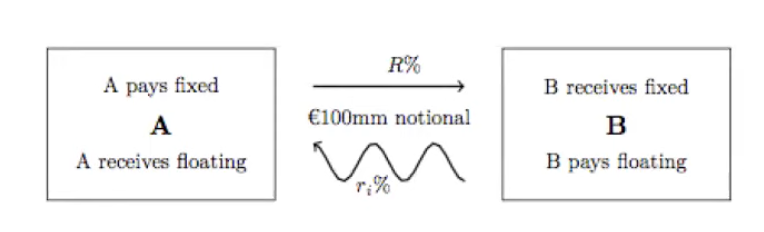
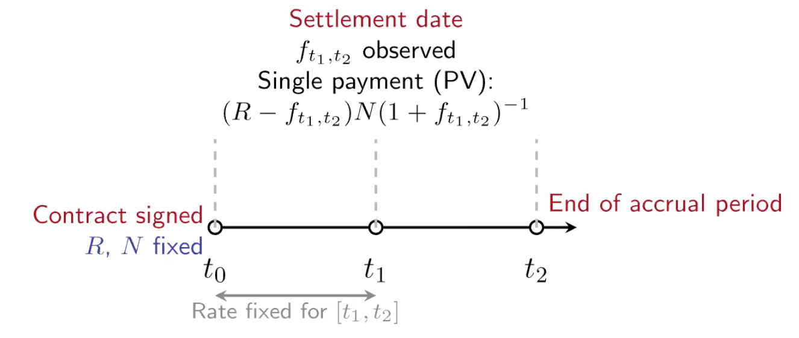

- **Timeline:**
    - Contract signed: $t_0$ ($R$, $N$ fixed)
    - Settlement date: $t_1$
    - End of accrual period: $t_2$
    - Rate fixed for $[t_1, t_2]$

### **FRAs and Interest Rate Swaps**

- A FRA is an OTC agreement, made on date $t_0$, which fixes an interest rate $R$ and a future time interval $[t_1, t_2]$, for a floating reference rate, $f_{t_1, t_2}$ plus a notional amount $N$
- The settlement date is $t_1$, when the reference rate for $[t_1, t_2]$ is published, and at $t_1$ there is a single payment being the present value of $(R - f_{t_1, t_2}) \times N$, i.e. (ignoring day counts:)
    - $(R - f_{t_1, t_2}) \times N \times (1 + f_{t_1, t_2})^{-1}$
- If this is positive then A pays B, and the converse if this is negative
- An interest rate swap (IRS) is just a sequence of successive FRAs starting at dates $t_0, t_1, t_2, \dots$. Standard swaps have quarterly payments and maturities of 2, 3, 5, 7, or 10 years

### **Summary of Fixed Income Products**

- Fixed income products are securities that make contractual payments of interest and principal on fixed, pre-specified dates
- **Table:**
    | Instrument | Definition | Cash Flows |
    |---|---|---|
    | Fixed Rate Note | Pays fixed coupon; principal at maturity | Regular fixed coupons; principal at maturity |
    | Floating Rate Note | Pays floating coupon (reference + spread); principal at maturity | Floating coupons reset each period; principal at maturity |
    | Forward Rate Agreement | Locks in forward rate on notional for a future period | Single cash settlement based on rate differential |
    | Interest Rate Swap | Exchange of fixed vs floating rates over multiple periods | Sequence of net cash flows at each settlement date |

## 2.2. Cash Flows and Net Present Value (NPV)

### **Cash Flows on an Amortised Loan**

- For example, these are the cash flows on a five-year amortised loan of $1000 with an interest rate of 10% interest

** Cash Flows to the Lender of a 5-Year Loan with 10% Interest (Interest + Principal)

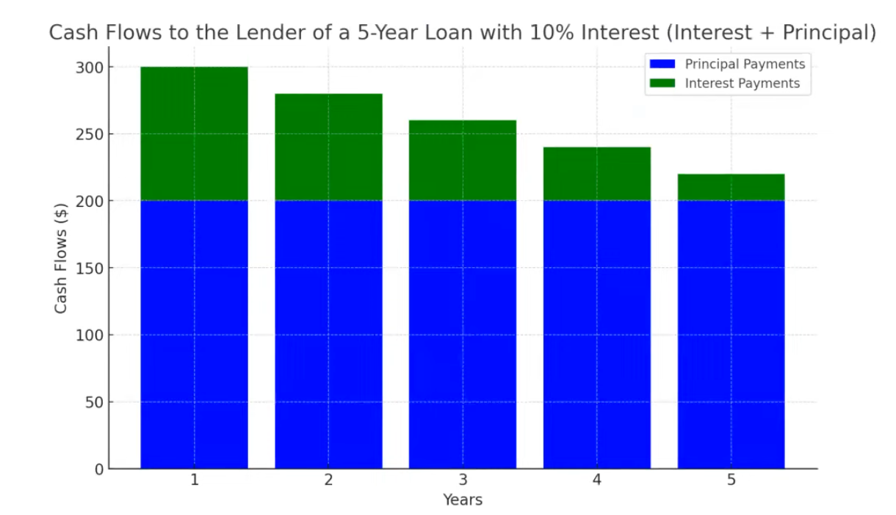

        - Year 1: ~$260 (Principal + Interest)
        - Year 2: ~$270 (Principal + Interest)
        - Year 3: ~$280 (Principal + Interest)
        - Year 4: ~$290 (Principal + Interest)
        - Year 5: ~$300 (Principal + Interest)

### **Cash Flows on a Fixed-Rate Bond**

** Cash Flows for a 10-Year Bond with 6% Annual Coupon

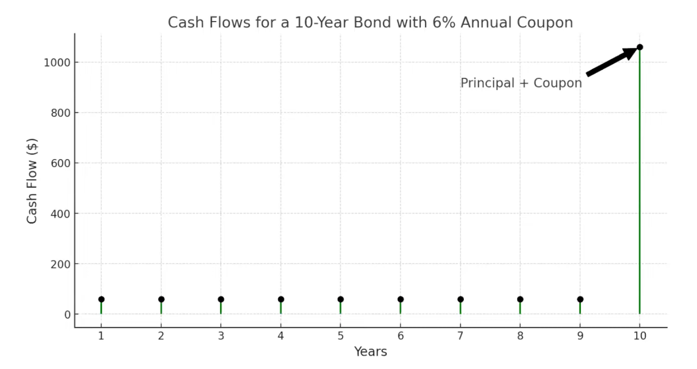

        - Years 1-9: ~$60 (Coupon)
        - Year 10: ~$1060 (Principal + Coupon)
- Note that the face value of this bond is $1000 not $100

### **Cash Flows on Fixed-for-Floating Interest Rate Swap**

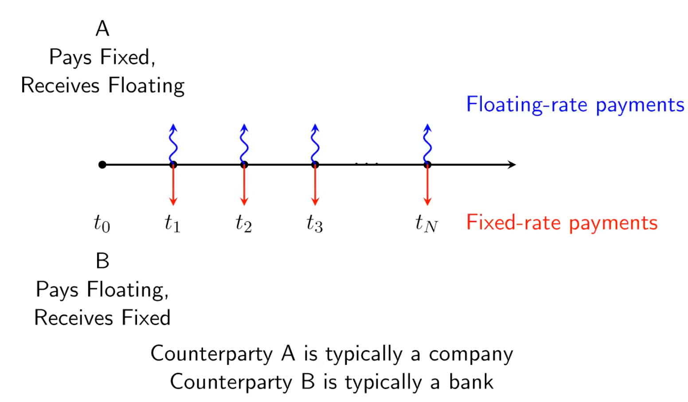

### **Valuation of Credit-Risky Products**

- A bank or a company's holdings of all real and financial assets are reported in a statement of their current financial position called a balance sheet
- When valuing credit-risky assets on a balance sheet, the audit is based on cash flows discounted to net present value (NPV) terms

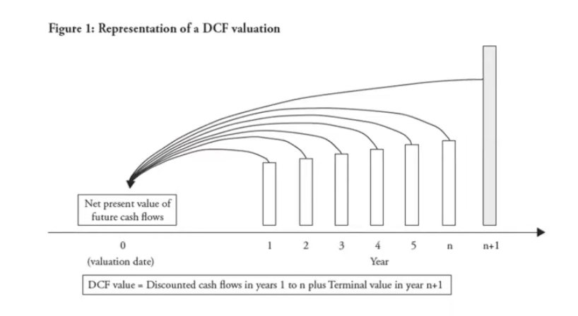

**DCF value = Discounted cash flows in years 1 to n plus Terminal value in year n+1**

### **Net Present Value – General Formula**

- **Formula:**
  - **NPV:** $\sum_{t=1}^{n} \frac{CF_t}{(1 + r_t)^t}$
- **Where:**
    - $CF_t$ is the cash flow amount at time $t$
    - $r_t$ is the discount rate used at time $t$
    - $n$ is the number of periods of the cash flows
- The discount rate $r_t$ depends on the time of the cash flow and the credit risk of the company which pays these cash flows

## 2.3. Credit Risk: Spreads, Rating and Value-at-Risk (VaR)

### **What is Credit Risk?**

- **Uncertainty in the value of an investment due to a credit event**
- Credit risk concerns the investment in a financial product based on a bilateral agreement between two counterparties
- A credit event is either:
    - A change in the credit rating of a counterparty which results in a change in the credit spread, or
    - The counterparty defaulting on their obligation
- So there are two kinds of credit risk:
    - Credit spread risk, also called credit migration risk
    - Credit default risk

### **Credit Ratings**

- Rating agencies, such as Moody's, S&P and Fitch, assign an issuer a rating or grade that indicates the possibility of default
- For example, S&P and Fitch ratings range from AAA, which is the best rating to AA, A, BBB, BB, B, CCC, CC, C and Default (D)
- The minimum rating for an investment-grade bond is BBB (equivalently, Baa in Moody's nomenclature)
- A rating agency downgrades a company when it becomes harder for the company to meet its obligations
- Ratings of less than BBB are called junk bonds or, in politically correct language, high yield securities

### **Credit Spread Risk**

- **The risk of loss resulting from changes in credit spreads**
- The discount rate for cash flows in the NPV formula is the risk-free rate plus a premium called the credit spread which the market requires for taking on a credit exposure
- Both risk-free rates and credit spreads depend on maturity – hence, we have yield curves
- Risk-free rates are yields from government bonds, so they depend on the country. Credit spreads also depend on the country and the credit rating of the counterparty
- For example, if a 3-year AA bond is issued by a US company, the relevant reference rate would be the yield on a 3-year Treasury bond and the spread would be the US 3-year AA spread

  
### **Term Structure of Credit Spreads**

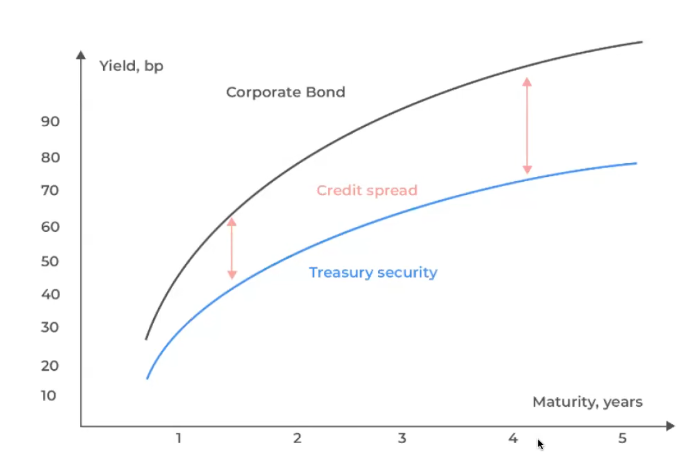

### **Relationship Between Credit Ratings and Credit Spreads**

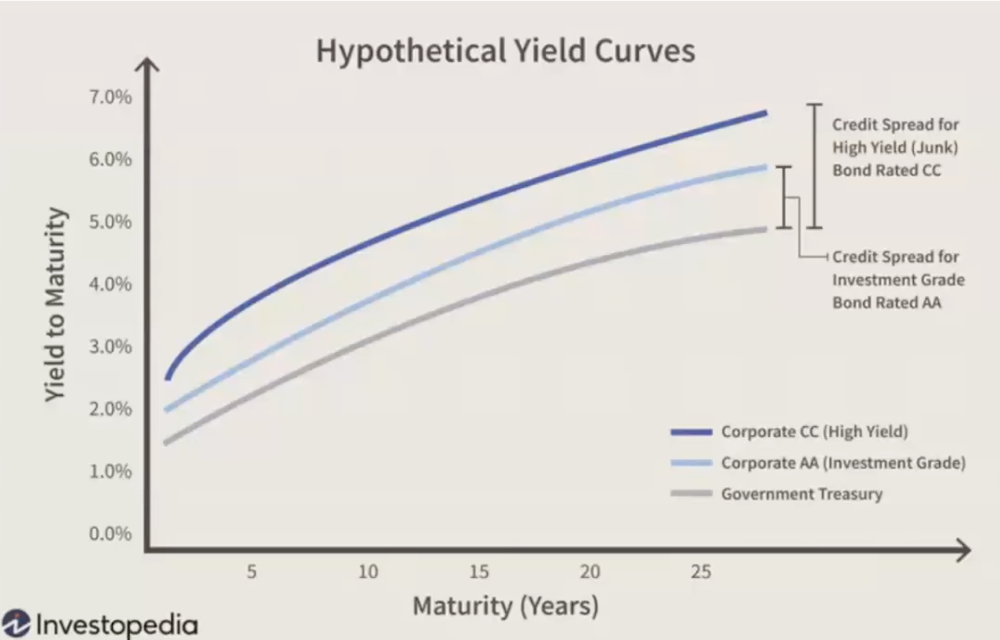

### **Why do Credit Spreads Change?**

- Credit spreads depend on the economic health of the company
- For example, General Motors (GM) 5-year bonds used to trade at a spread of 3% above the 5-year Treasury bond
- So if the 5-year Treasury bond rate was 4%, the 5-year GM bonds would be trading at a yield of 7%
- Now GM bonds are only just classified as BBB, namely investment grade bonds. In fact, Fitch’s credit rating of GM used to be below BBB making them junk bonds
- Also note that credit spreads widen when the economic health of the country deteriorates – see time series of different credit spreads in the US

### **Credit Migration Probabilities**

- Credit migration means a change in credit rating, also called a credit transition
- Rating agencies review their credit ratings by using historical data to analyze the frequency of occurrences of credit migration
- E.g., they count the number of AA companies that changed to AAA – and the number of BBB companies that changed to B, etc. – during a period of time, typically during the last year (1-year transition matrix) or five years (5-year transition matrix)
- On other words, these data allow rating agencies to compute empirical migration frequencies, which are then used to infer the probability of a rating change over the next year, or five years

### **Example of a 1-Year Transition Matrix**

**Probability of migrating to rating by year end (%)**
| Original Rating | AAA | AA | A | BBB | BB | B | CCC | Default |
| --- | --- | --- | --- | --- | --- | --- | --- | --- |
| AAA | 93.66 | 5.83 | 0.40 | 0.08 | 0.03 | 0.00 | 0.00 | 0.00 |
| AA | 0.66 | 91.72 | 6.94 | 0.49 | 0.06 | 0.09 | 0.02 | 0.01 |
| A | 0.07 | 2.25 | 91.76 | 5.19 | 0.49 | 0.20 | 0.01 | 0.04 |
| BBB | 0.03 | 0.25 | 4.83 | 89.26 | 4.44 | 0.81 | 0.16 | 0.22 |
| BB | 0.03 | 0.07 | 0.44 | 6.67 | 83.31 | 7.47 | 1.05 | 0.98 |
| B | 0.00 | 0.10 | 0.33 | 0.46 | 5.77 | 84.19 | 3.87 | 5.30 |
| CCC | 0.16 | 0.00 | 0.31 | 0.93 | 2.00 | 10.74 | 63.96 | 21.94 |
| Default | 0.00 | 0.00 | 0.00 | 0.00 | 0.00 | 0.00 | 0.00 | 100.00 |

### **Credit Default Risk**

- When a corporation becomes insolvent and enters liquidation or bankruptcy, it will have defaulted on its obligations
- A credit default event occurs when a counterparty does not meet the obligations of a credit exposure, and this is formally recorded in financial statements, a D credit rating, and possibly legal proceedings
- When a company enters bankruptcy the bondholders will recover some amount, depending on their seniority
- The proportion of outstanding payments recovered is called the recovery rate

### **Recovery Rates**

- There is a seniority structure in the obligor's debt whereby senior debt holders recover more than holders of subordinated debt
- For instance, about 70% is recovered from senior secured bank loans, on average
- But senior unsecured bondholders recover about 40% and junior subordinated debt holders recover less than 20%, on average

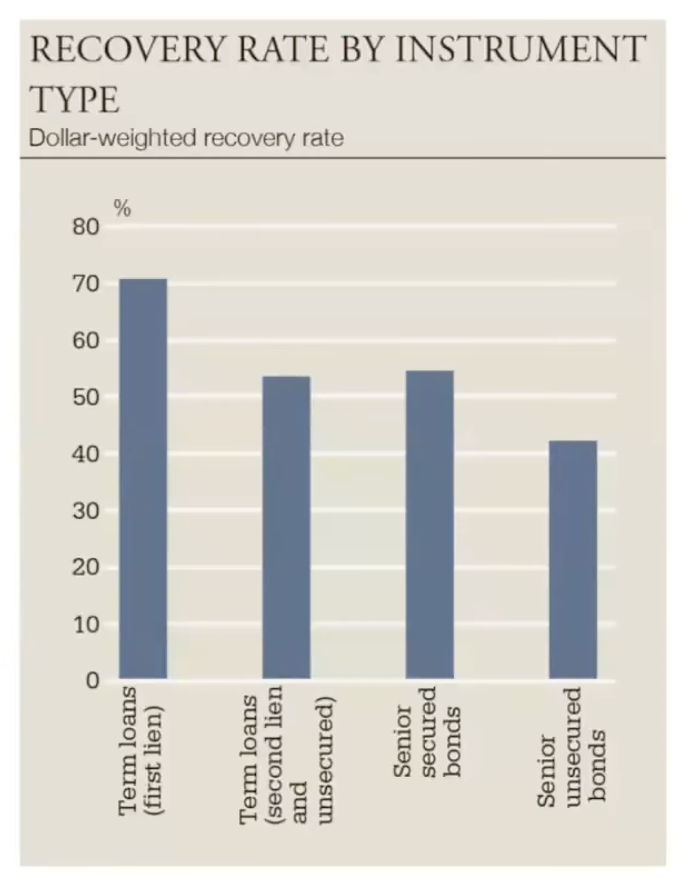

### **Measuring Credit Risk**

- The risk of a credit exposure depends on its size, maturity, and the obligor's default probability – and the risk of a portfolio of credit exposures depends on how defaults and migrations are correlated between obligors
- Credit Value-at-Risk models changes in the portfolio value due to credit events, not just defaults but ratings upgrades and downgrades, using 1-year transition matrices and mathematical models for correlation

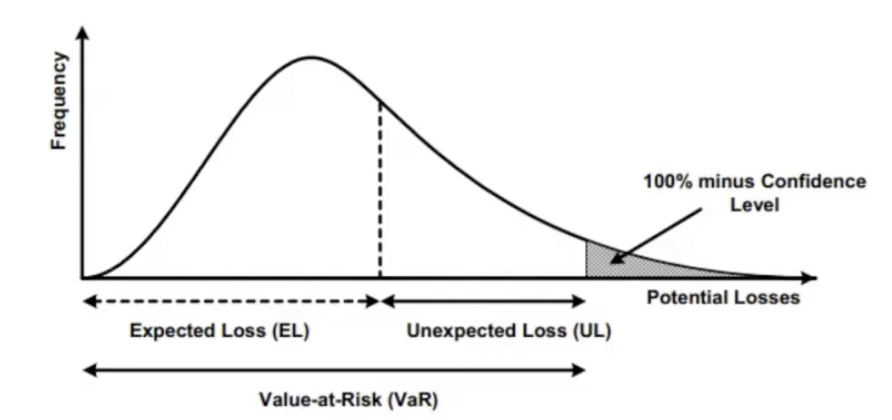

### **Methods for Mitigating Credit Risks**

- **Diversification:** Spreading investments or loans across multiple borrowers or sectors reduces the impact of systemic risk
- **Collateral:** Securing loans with assets which the lender can seize to recover losses if the borrower defaults
- **Covenants:** Loan agreements may include covenants that impose restrictions on the borrower's behavior, such as maintaining a given solvency ratio, to reduce credit risk
- **Credit Insurance:** By entering a credit default swap lenders can purchase insurance to protect against borrower defaults
- **Credit Derivatives:** For example, a bank could tranche a portfolio of 1000 mortgages into a collateralized debt obligation and then sell off the lowest tranche i.e., the first 100 mortgages to default

## 2.4. What Drives the Interest Rate Swap (IRS) Market?

### **International Accounting Standards**

- Interest rate swaps are the largest class of derivative products traded with around $470 trillion notional globally, according to the International Swaps and Derivatives Association (ISDA) in mid-2024
- The huge market for IRS is driven by differences in International Accounting Standards (IAS) rules, where banks use mark-to-market accounting but most other companies use cash accounting
- **Cash accounting** records transactions in the balance sheet only when cash changes hands. Income and expenditures are recorded only when received and paid, but auditors of accounts will also review future cash flows
- **Mark-to-Market (MtM) accounting** records the value of all the assets and liabilities in the balance sheet based on their current market prices, reflecting real-time changes in value

### **Floating Rates are Risky in Cash Accounting**

- Audits of company accounts are based on past and future cash flows, and under cash accounting, future cash flows are always discounted using a fixed interest rate
- Hence, fixed-rate cash flows (e.g. from a fixed-coupon bond) are known and can be provisioned for so they are not very risky
- But floating-rate cash flows (e.g. from a floating-rate bond) are risky because there is uncertainty about cash flow amounts due to possible changes in reference rate rates and credit ratings

### **Fixed Rates are Risky in MtM Accounting**

- In MtM accounting, future cash flows are discounted using a floating rate which reflects the credit rating of the cash flow payer
- For instance, a cash flow in two years time from a AA-rated UK company called XYZ should be discounted at the UK reference rate + UK 2-year AA spread
- Suppose the cash flow is the coupon from a floating-rate note issued by XYZ. This payment is based on the same reference rate + 2-year AA spread that the bank uses to discount it!
- This shows that, in general, under MtM accounting, floating cash flows are less risky than fixed cash flows

### **How an IRS Changes Floating to Fixed-Rate Payments**

- The loan desk on a bank prefers to make floating-rate loans rather than fixed-rate loans – because banks use MtM accounting
- But companies use cash accounting, so they prefer to have fixed-rate loans
- By entering an IRS with a bank at the same time as taking the floating-rate loan from another (or the same) bank, a company can pay a fixed swap rate to receive floating-rate payments which exactly match their payments on the loan
- The company sends these floating-rate payments to the bank that made the loan, so the company ends up only making fixed-rate payments

### ** Example**

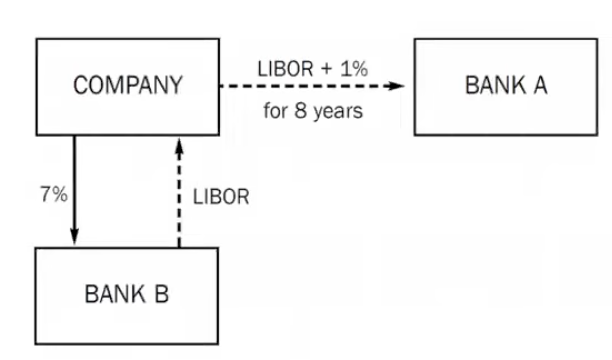
- **Diagram:**
    - **Company:**
        - Pays LIBOR + 1% to Bank A
        - Receives LIBOR from Bank B
        - Pays 7% to Bank B
    - **Bank A:**
        - Receives LIBOR + 1% from Company
    - **Bank B:**
        - Pays LIBOR to Company
        - Receives 7% from Company
- A company gets an 8-year loan for $1m from bank A on which it pays interest of reference rate + 1% per annum
- The company enters an 8-year IRS with bank B, with notional $1m, to receive reference rate and pay the swap rate of 7% per annum
- By matching the maturity of the swap with the loan, and equating their notional amounts this company is now effectively paying 8% fixed interest for 8 years

### **Swap Rates**

- Two counterparties (typically a bank and a company) in an interest rate swap (IRS) swap fixed payments $R\%$ for floating payments $r_t\%$ on a notional amount, up to a certain maturity with payments at $i = 1, 2, ...N$
- Floating payments are typically at reference rate + spread
- The swap rate is fixed so that the NPV of cash flows is zero – see example on the next slide
- Swap rates are reset periodically, e.g. they might be reset every three months for five years, so each time the floating rate is based on the current 3-month forward reference rate
- The new swap rate is reset so that NPV of payments over the remaining life of the swap is zero

### **Excel Example: Swap Rate Calculation**

- **Title:** Excel Example: Swap Rate Calculation
- **Text:**
    - Swap_Rate_Calculation_Two-year_Quarterly.xlsx calculates the swap rate for a two-year IRS with quarterly resets. The red calls can be changed. Note that the notional amount has no effect on the final answer shown in blue.
- **Table:**
    | Period | Forward Rate | Discount Factor | Floating Payment | PV of Floating Payment | PV Factor (Fixed Leg) |
    |---|---|---|---|---|---|
    | 1 | 5.00% | 0.9877 | £1.2500 | £1.2346 | 0.24691 |
    | 2 | 5.10% | 0.9751 | £1.2750 | £1.2433 | 0.24378 |
    | 3 | 5.20% | 0.9625 | £1.3000 | £1.2512 | 0.24062 |
    | 4 | 5.30% | 0.9497 | £1.3250 | £1.2583 | 0.23742 |
    | 5 | 5.40% | 0.9368 | £1.3500 | £1.2646 | 0.23419 |
    | 6 | 5.50% | 0.9238 | £1.3750 | £1.2702 | 0.23095 |
    | 7 | 5.60% | 0.9107 | £1.4000 | £1.2750 | 0.22769 |
    | 8 | 5.80% | 0.8961 | £1.4500 | £1.2993 | 0.22401 |
    |  |  |  | Notional Amount | Total | 1.88557 |
    |  |  |  | £100 | £10.0966 | Swap Rate |
    |  |  |  |  |  | **5.3546%** |

### **Explanation of the Swap Rate Calculation**

- **Period:** Represents each quarterly payment date over 2 years (1 to 8).
- **Forward Rate:** Three-month forward rate yield curve
- **Discount Factor:** $DF_t = (1 + r_t \times 0.25)^{-1}$ where $r_t$ is the (annualised) three-month forward rate at time $t$
- **Floating Payment:** $FP_t = r_t \times 0.25 \times \text{Notional}$
- **PV of Floating Payment at time $t$:** is $DP_t \times PF_t$
- **PV Factor (Fixed Leg) at time $t$:** is $0.25 \times DF_t$
- **Swap Rate Calculation:** The swap rate is a fixed rate such that the NPV of fixed payments equates to the NPV of floating payments, therefore:
    - **Swap Rate:** $\frac{\sum PV \text{ of Floating Payments}}{\sum PV \text{ Factors (Fixed Leg)}}$

## 2.5. Credit Derivatives and the Banking Crisis

### **What is a Credit Derivative?**

- A credit derivative is an OTC contract which allows a creditor to transfer the risk of an obligor defaulting to a third party
- An unfunded credit derivative is one where credit protection is bought and sold between bilateral counterparties without the protection seller having to pay anything unless default occurs. Most derivatives of this type are **credit default swaps (CDS)**
- In a funded credit derivative the protection seller provides cash or asset upfront. For instance, in a **credit-linked note (CLN)** the protection seller pays for a note which gives them regular coupon payments. Then if a specified credit event occurs, these payments stop and they may lose part or all of the principal

### **Credit Default Swaps (CDS)**

- The buyer of the CDS makes a series of payments to the seller, with amounts being based on the CDS spread. In exchange, the buyer receives a pay-off from the seller if the credit defaults
- Left: The buyer purchases a CDS at time $t_0$ and makes regular premium payments at times $t_1, t_2, t_3, ...$ and so on until the end of the contract unless the associated instrument suffers a credit default
- Right: If the underlying instrument suffers a credit default at $t_5$, then the seller compensates the buyer for that loss, and the buyer ceases paying premiums to the seller
- **Diagrams:**
    - Left: Timeline showing protection buyer making payments to protection seller from $t_0$ to $t_n$.
    - Right: Timeline showing protection buyer making payments to protection seller from $t_0$ to $t_5$, then protection seller compensating protection buyer after a credit default event at $t_5$.

### **Naked Credit Default Swaps**

- The seller of a CDS insures the buyer against default in payment of some reference credit-risky cash flow
- The term naked CDS refers to the case that the reference credit is not held by the buyer of the CDS. Naked CDSs are not allowed in the UK and Europe, but they are in the US
- In 2008 investment banks like Goldman Sachs, Lehman Brothers and Bank of America sold vast quantities of CDSs on their own Collateralised Debt Obligations (CDOs) to people that had not purchased any tranches of these CDOs
- The default of these CDOs caused the bankruptcy of Lehman Brothers, which precipitated the 2008 banking crisis

### **Structured Products and Securitization**

- A typical example of a structured product is an **asset-backed security (ABS)** whose income payments are derived from a specified pool of underlying assets called the **collateral** for the security
    - The pool of assets is typically a group of small, risky and illiquid assets which are unable to be sold individually, such as credit card payments, or car loans
- Pooling the assets into financial instruments allows them to be sold to general investors, a process called **securitization**
    - Securitization allows the risk of investing in the illiquid assets to be diversified, because each asset represents a fraction of the total value of the entire pool

### **Mortgage Backed Securities (MBS)**

- An MBS is a particular type of ABS. It is like a bond but with payments backed by a portfolio of mortgages
- MBS have been traded in capital markets for a very long time. They started in 1970 when they were issued by the US Government National Mortgage Association
- Unlike CDSs which are OTC agreements, MBSs and ABSs are traded like securities, so they are rated by agencies such as Fitch, Moodys and S&P

### **Collateralized Debt Obligation (CDO)**

- A CDO is a structured ABS which pays investors in a prescribed sequence, based on the cash flow the CDO collects from a pool of loans or credits
- A CDO allows investors to take different tranches of credit risk according to their risk appetite
- The sequence of cash flows (of interest and principal payments) from the pool has a seniority in defaults
- That is, if the cash collected by the CDO is insufficient to pay all of its investors because some of the ABSs have defaulted on payments then the lowest, most junior tranches suffer losses first

### ** Illustration of a Collateralised Loan Obligation**

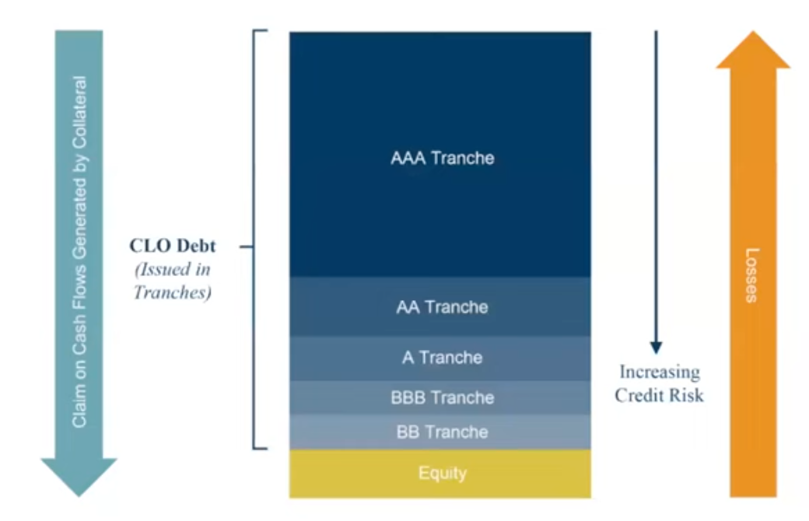
- **Diagram:**
    - **Left Arrow (Green):** Claims on Cash Flow, Decreasing by Collateral
    - **Middle Bar (CLO Debt issued in tranches):**
        - AAA Tranche (Top)
        - AA Tranche
        - A Tranche
        - BBB Tranche
        - BA Tranche
        - Equity (Bottom)
    - **Right Arrow (Orange):** Losses, Increasing Credit Risk
- The equity tranche is the first group to lose payment from defaults, so these investors receive the highest coupons – the AAA tranche is the last to lose payments, so they get the lowest coupons

### **The Role of Credit Derivatives in the 2008 Banking Crisis**

- The film and book *The Big Short* chronicles the US housing market bubble and collapse and the consequent 2008 financial crisis
- It focuses on Scion Capital, a small hedge fund run by Michael Burry
- As banks bundled risky subprime loans into MBSs and then put these MBSs into CDOs, Scion Capital bet against the market by purchasing naked CDSs to bet that these home-owners could not pay off their loans
- When home-owners defaulted, so did these MBSs and then even the AAA-rated tranches of the CDOs lost all their market value, triggering the financial crisis. Michael Burry's CDS bets paid off, earning Scion Capital huge profits while millions lost their homes and jobs
- The story exposes systemic failures in the financial system, including corrupt banks, inaccurate ratings by agencies, and regulatory failures

