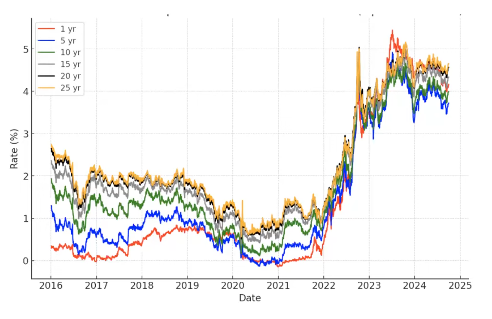
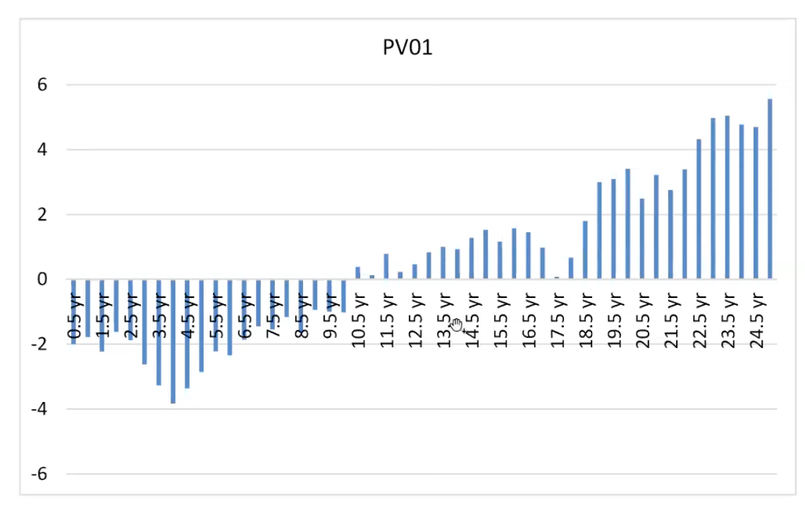

# Study Notes on **Financial Risk Management** by Professor Carol Alexander 

Original resource: [youtube](https://www.youtube.com/watch?v=mXC5yJ5MKwM&list=PL_V1gySvrP_ums2nxs_YuKY5Ufdmhyoh7&index=6)

# Topic 5: Fixed Income Portfolios

## 5.1 Cash-Flow Portfolios and their Risk Factors
## 5.2 Mapping Cash Flows

## 5.3 Value at Risk for Cash-Flow Portfolios


---

### **Risk Factor Sensitivities**

- When measuring VaR for a large portfolios we must represent it using **sensitivities** to its risk factors

- For example, a domestic stock portfolio has market indices for risk factors and the sensitivities are called betas

- But for a cash-flow portfolio, the risk factors are interest rates at **selected vertices along a yield curve**

- And the risk-factor sensitivities are the **change in PV of the cash flow when interest rates increase by 1 basis point**

- We call this sensitivity the **present value of a basis point** or **PV01** for short


---

### **Present Value of a Basis Point (PV01)**

- Suppose a cash flow $c_i$ has maturity $t_i$ with spot interest rate $r_i$

- The **present value of a basis point** move, PV01, of $c_i$ is the sensitivity of $c_i$ to a 1 bp increase in $r_i$:

```math
\text{PV01}_i = c_i \left( (1 + r_i + 0.01\%)^{-t_i} - (1 + r_i)^{-t_i} \right)
```

- Example: What is the PV01 of cash flow of $5m in 2 years time when the 2-year interest rate is 4% ?

```math
\text{PV01} = 5,000,000 \left( (1 + 4.01\%)^{-2} - (1 + 4\%)^{-2} \right)
```

  That is: $\text{PV01} = 5,000,000 \times (-0.00018) = -890$


---

### **Factor Model for Cash Flows**

- For one cash flow, $\text{PV01}_i$ is the change in PV of the cash flow at vertex $t_i$ when $r_i$ increases by 1 bp

- But for a mapped cash flow **portfolio** is represented by a whole PV01 vector, $\mathbf{p} = (\text{PV01}_1, ..., \text{PV01}_n)'$

- The factor model represents the **change in value** $\Delta P_t$ of the **cash-flow portfolio** at time $t$, assuming $\mathbf{p}$ is held constant, i.e.

```math
\Delta P_t = \text{PV01}_1 \Delta r_{t1} + ... + \text{PV01}_n \Delta r_{tn} = \mathbf{p}' \Delta \mathbf{r}_t
```

  where 
  ```math
  \Delta \mathbf{r}_t = (\Delta r_{t1}, \Delta r_{t2}, ..., \Delta r_{tn})'
  ``` 
  is the vector of basis point changes in interest rates at time $t$


---

### **Normal VaR for Cash Flows**

- We need to find $\mathbb{V}(\Delta P)$. Applying the **quadratic form rule for variance** – see Topic 3 Part 6 (slide 58) – to the factor model, we have:

```math
\mathbb{V}(\mathbf{p}' \Delta \mathbf{r}) = \mathbf{p}' \mathbb{V}(\Delta \mathbf{r}) \mathbf{p}
```

- We know $\mathbf{p}$, this is the PV01 vector of the mapped cash flows at the time we measure VaR. And we use historical data on $\Delta \mathbf{r}_t$ to find $\mathbb{V}(\Delta \mathbf{r})$ in Excel

- The base VaR holding period is the same as the frequency of the data used to obtain the **covariance matrix** $\mathbb{V}(\Delta \mathbf{r})$

For example, if data are daily, so that $\mathbb{V}(\Delta \mathbf{r})$ is the covariance matrix of daily changes in interest rates, the normal VaR formula gives $\text{VaR}_{1,\alpha}$. 

And if data are weekly, so that $\mathbb{V}(\Delta \mathbf{r})$ is the covariance matrix of weekly changes in interest rates, the formula gives $\text{VaR}_{5,\alpha}$.

- Whatever the base frequency of the data, normal VaR can be scaled using the square-root-of-time rule in the usual way

---

### **Summary and Example**

- Suppose our data are daily, i.e. $\Delta \mathbf{r}_t$ are daily changes
- Taking variances of the factor model $\Delta P_t = \mathbf{p}' \Delta \mathbf{r}_t$ yields:

```math
\mathbb{V}(\Delta P) = \mathbf{p}' \mathbb{V}(\Delta \mathbf{r}) \mathbf{p}
```

- $\mathbb{V}(\Delta \mathbf{r})$ is the covariance matrix of daily changes in interest rates
- Then, using zero mean in the normal VaR formula, we have:

```math
\text{VaR}_{h,\alpha} = \Phi^{-1}(1 - \alpha) \sqrt{h \, \mathbb{V}(\Delta P_t)}
```

---

### **Historical VaR for Cash Flows**

- Historical simulation directly applies the factor model

```math
\Delta P_t = \mathbf{p}' \Delta \mathbf{r}_t \stackrel{a}{\sim}
```

  to historical time series on the vector $\Delta \mathbf{r}_t$, namely the daily changes in interest rates, measured in basis points

- On each day $t$ we multiply the vector $\Delta \mathbf{r}_t$ by the **fixed PV01 vector** $\mathbf{p}$, which represents the **future cash flows as seen from the day when VaR is measured**

- This gives a single column representing the time series for $\Delta P_t$

- Then 
```math
\text{VaR}_{1,\alpha} = -\text{PERCENTILE}(\text{column for } \Delta P_t, \alpha)
```

- And 
```math
\text{VaR}_{h,\alpha} = \sqrt{h} \, \text{VaR}_{1,\alpha}
```
## 5.4 Example: VaR for a Gilts Portfolio

---

### **BoE Spot Curve Evolution**




We use the rates for **0.5, 1, 1.5, ..., 25 years** as vertices for measuring normal and historical VaR, for a cash-flow portfolio of long and short UK government bonds, called **Gilts**, on 30 Sept 2024


---

### **PV01 of Mapped Cash Flows ('000 GBP)**



This is $\mathbf{p}$, the vector of PV01 cash flow sensitivities, after mapping to vertices 0.5, 1, 1.5, ..., 25 years, for our Gilts portfolio on 20 Sept 2024


---

### **Question: What’s the bet on the yield curve?**

1. Parallel shift up  
2. Parallel shift down  
3. Tilt (short up, long down)  
4. Tilt (short down, long up)


---

### **Normal VaR**

- The variance of the daily P&L of the mapped cash flow is

```math
\mathbb{V}(\Delta P) = \mathbf{p}' \mathbb{V}(\Delta \mathbf{r}) \mathbf{p}
```

  where $\mathbf{p}$ is the PV01 vector given on the previous slide

- We compute the covariance matrix $\mathbb{V}(\Delta \mathbf{r})$ by applying the COVAR command in Excel to daily basis point changes in interest rates

- We calculate $\mathbb{V}(\Delta P)$ using the MMULT command in Excel and then, taking the square root, gives the standard deviation of daily P&L

- Now, applying the normal VaR formula and the usual square root of time rule, we obtain the 1% 10-day normal VaR:

```math
\text{VaR}_{10,1\%} = 1,769,416 \text{ GBP}
```

---

### **Historical VaR**

- On each day $t$ in our historical data we multiply the basis point change vector $\Delta \mathbf{r}_t$ by the fixed PV01 vector $\mathbf{p}$

- This gives the observation for that day on $\Delta P_t$, and we do this for each day $t = 1, 2, ..., 2208$ – because there are 2208 rows in the spreadsheet of daily basis point changes

- Now we find the 1% quantile of the historical P&L in Excel by applying the PERCENTILE function in Excel, giving the 1% quantile:

```math
  q_{1\%} = -598,309 \text{ GBP}
```

- Finally we use the square root of time rule to obtain the 1% 10-day historical VaR:

```math
\text{VaR}_{10,1\%} = -q_{1\%} \times \sqrt{10} = 1,962,959 \text{ GBP}
```
