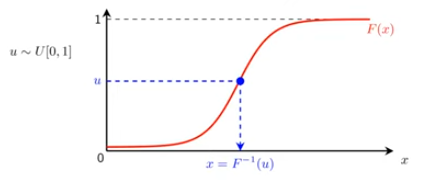
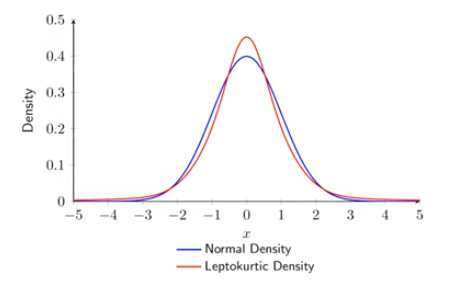

# Study Notes on **Financial Risk Management** by Professor Carol Alexander 

Original resource: [youtube](https://www.youtube.com/watch?v=mXC5yJ5MKwM&list=PL_V1gySvrP_ums2nxs_YuKY5Ufdmhyoh7&index=6)

# Topic 4: Volatility and Value-at-Risk

## 4.1 Defining Value-at-Risk (VaR)

**Definition of Value-at-Risk (VaR)**

VaR is a loss we are ‘confident’ will not be exceeded when the portfolio remains unchanged for some time period

*   ‘Remain unchanged’ could mean either (i) the holdings are constant – i.e. the portfolio is **not rebalanced**, or (ii) the weights are constant – which assumes the portfolio is rebalanced
*   In mathematics the above definition reads: “The $\alpha\%$, $h$-day VaR, written $\text{VaR}_{h,\alpha}$, is $-1 \times \alpha$-quantile of the discounted $h$-day P&L distribution”
*   Terminology for the two VaR parameters:
    *   $h$ is the **holding period** for the VaR model – this is also called the **risk horizon** – it is the time-period over which the portfolio is assumed to remain unchanged
    *   $\alpha\%$ is the **significance level** for the VaR estimate – alternatively we say $(1 - \alpha)\%$ is the **confidence level**

**Examples of VaR**

**5% daily VaR = $2 million** means that

*   ... we are 95% confident that we will not lose more than $2 million when the portfolio remains unchanged for one day
*   ... we anticipate that this portfolio loses $2 million, or more, about once every 20 days

**1% 10-day VaR = $15 million** means that

*   ... we are 99% confident that we will not lose more than $15 million when the portfolio remains unchanged over 10 days
*   ... we anticipate that this portfolio loses $15 million, or more, about one two-week period in every 100

**Parameters: Holding Period $h$ and Significance Level $\alpha$**

*   Banking regulation sets $h = 10$ for market risk capital requirements and $h = 1$ for **backtesting** the VaR model
*   Hedge funds, asset managers, corporate treasury and institutional investors may set $h > 10$, or more
*   Banking regulation sets $\alpha = 1\%$ (meaning a confidence level of 99%) and $\alpha = 2.5\%$ (meaning a confidence level of 97.5%) for **market risk capital requirements**
*   Other users may set a higher $\alpha$ (lower confidence level), e.g. $\alpha = 5\%$, meaning 95% confidence

**Is VaR measured in $ or %?**

*   VaR is a level of loss and so it relates to a quantile of the portfolio's **profit and loss** (P&L) distribution, measured in $
*   But when a portfolio value has been **trending** it is best to use a quantile of the portfolio **returns** distribution.
*   Then VaR is given in % terms: it is a loss expressed as a % of the current portfolio value. **VaR in $ = VaR in % × current portfolio value**
*   Recall that returns do not make sense if the portfolio value can be zero or negative. Then we must measure VaR directly from the P&L distribution

## 4.2 Introducing VaR Models

**Portfolio-Level vs Risk-Factor Modelling**

Two ways to model portfolio risk:

**1. Portfolio Level:**

*   Keep the weights (or holdings) constant
*   Model the portfolio returns (or P&L) as the weighted sum of **correlated** individual asset returns (or P&L)
*   **Advantages:** Full capture of all risks (**systematic** and **idiosyncratic**)
*   **Limitations:** High-dimensional, less interpretable, no insight into common drivers

**2. Risk-Factor Level:**

*   Map portfolio to **systematic risk factors** by computing the sensitivities to these risk factors
*   Model only the **systematic**, i.e. the **non-diversifiable** part of the portfolio risk using risk-factor returns (or P&Ls) while holding the sensitivities constant
*   **Advantages:** Reduces dimensionality, identifies main systematic sources of risk
*   **Limitations:** Ignores **idiosyncratic** risks – but these are typically regarded as **diversifiable**

Choice between portfolio or risk-factor level depends on regulatory requirements and portfolio structure

**Risk Factors Depend on Portfolio Type**

| Portfolio Type | Typical Risk Factors |
| :--- | :--- |
| Domestic Equities | Sector indices (e.g. Pharma, Banking, Utilities) |
| Fixed Income | Interest rates at different maturities |
| Options | Underlying + implied volatilities |
| Commodities | Futures at different maturities |
| International | As above + exchange rates |
| Global Equities | Broad market indices + exchange rates |

**Note:** In this topic we only consider modelling VaR at the portfolio level – or indeed, at the single-asset level. Topics 5, 6 and 7 cover the process of **risk factor mapping** – the mathematics of portfolio mapping on the type of portfolio

**Four Steps for VaR Estimation**

1. Set the first parameter: the holding period *h*
2. Create a probability distribution for the *discounted* portfolio returns (or P&L) over the next *h* days
3. Set the second parameter: the significance level *α*
4. Estimate VaR as −1 × *α*-quantile of this distribution

Different assumptions for step 2 ⇒ different VaR models

**Three Main VaR Models**

1.  **Normal VaR:** Assumes the distribution of returns is N(μ, σ²) – We use mean and standard deviation of returns over a recent sample as estimates for μ and σ
2.  **Historical VaR:** Build a histogram of historical of returns (or P&L) and read off the VaR from a quantile
3.  **Monte Carlo VaR:** Assume that returns have some parametric distribution, then simulate lots of returns from this distribution, read off the % VaR as a quantile

Note: It is possible to apply any of these models to P&L distributions too – which is necessary for portfolios with short positions – but for portfolios with only long positions, it is always better to use returns, measure VaR in %, and then multiply by the portfolio value (at the time the VaR is measured) to obtain the final $ VaR

**Which VaR Model?**

*   **Normal VaR:** Applies only to a linear portfolio. Here the returns (or P&L) are assumed to have a normal distribution
*   **Historical Simulation:** Applies to all portfolios, including those containing options. It employs historical data without any parametric assumptions about their returns (or P&L)
*   **Monte Carlo Simulation:** Typically used for complex option-like portfolios, an alternative to historical simulation

**Normal VaR Model**

**Z ~ N(0, 1) is the standard normal variable**

*   **φ = density function (pdf)**
*   **φ(z) = $\frac{1}{\sqrt{2\pi}} \exp(-0.5z^2)$**

*   **Φ = distribution function (cdf)**
*   **Values of Φ(z) are given in statistical tables**

**Interpretation of Standard Normal Quantile**

For the standard normal distribution: (in Excel)

= NORMSDIST(x) gives the value Φ(z)
= NORMSINV(α) gives a quantile zα of the standard normal distribution, such that P(Z < zα) = α
e.g. NORMSDIST(0.15)=0.56 and NORMSINV(0.56)=0.15

Φ distribution function

**Quantiles and Critical Values**

*   $\Phi(z) \in (0, 1)$ is the distribution function for $Z \sim N(0, 1)$
*   The inverse function $\Phi^{-1}(\alpha)$ for $\alpha \in (0, 1)$ is the $\alpha$-quantile $z_\alpha$
*   When $\alpha$ is near 0 or 1 we call the quantile a **critical value**
*   We often use the following critical values of $N(0, 1)$:
    *   $\Phi^{-1}(0.99) = 2.326, \Phi^{-1}(0.975) = 1.960, \Phi^{-1}(0.95) = 1.645$
    *   $\Phi^{-1}(0.01) = -2.326, \Phi^{-1}(0.025) = -1.960, \Phi^{-1}(0.05) = -1.645$
*   Because normal distributions are symmetric we have
    *   $\Phi^{-1}(1 - \alpha) = -\Phi^{-1}(\alpha)$

**Calculating a Quantile: Three Ways**

1.  **Normal VaR:** Use the $\alpha$-quantiles of the standard normal distribution denoted $\Phi^{-1}(\alpha)$ and apply the **standard normal transformation** to convert them into quantiles of a $N(\mu, \sigma^2)$ distribution
2.  **Historical VaR:** Use the **= PERCENTILE** function in Excel on the time series of historical portfolio returns or P&L
3.  **Monte Carlo VaR:** Use the **= PERCENTILE** function in Excel on the simulated data for portfolio returns or P&L, based on some parametric assumption

## 4.3 Building VaR Models

**Data Requirements for Building the Distribution**

*   Typically, the probability distribution for the (discounted) portfolio returns (or P&L) over the next $h$ days is based on data for the recent history of the portfolio returns (or P&L) – assuming these are indicative of future returns (or P&L)
*   Banking regulation (Basel III) recommends that banks use about 3–5 years of daily data to build this distribution. A minimum of 1 year of data daily must be used
*   The amount of data required depends on the model: **historical** VaR models need lots and lots of data, especially when $\alpha$ is small – but other models are based on **parameters** which can be estimated using not very much data at all – or even made up

**Formula for Normal VaR**

Assumption on portfolio *h*-day returns:
$$X_h \overset{i.i.d.}{\sim} N(\mu_h, \sigma_h^2)$$

Then:
$$\text{VaR}_{h,\alpha} = \Phi^{-1}(1 - \alpha)\sigma_h - \mu_h$$

When *h* is small we often assume that $\mu_h = 0$

For example, if $X_1 \overset{i.i.d.}{\sim} N(0, 0.8^2)$ then $$\text{VaR}_{1,5\%} = \Phi^{-1}(0.95) \times 0.8 = 1.645 \times 0.8 = 1.316\%$$

Note: VaR is given as a percent of the current portfolio value, since the model is based on returns

**Proof of Normal VaR Formula**

Recall the standard normal transformation:
$$X \sim N(\mu, \sigma^2) \Rightarrow \frac{X - \mu}{\sigma} \sim N(0, 1)$$

*   Suppose $X_h \sim N(\mu_h, \sigma_h^2)$ and let $x_{h,\alpha}$ be the $\alpha$-quantile of $X_h$:
    $$\text{Prob}[X_h < x_{h,\alpha}] = \alpha$$

*   Then, using the **standard normal transformation**:
    $$\text{Prob}[X_h < x_{h,\alpha}] = \text{Prob}\left[Z < \frac{x_{h,\alpha} - \mu_h}{\sigma_h}\right] = \alpha$$

where $Z \sim N(0, 1)$

**Normal VaR in $ Terms**

We prefer to measure % VaR (if possible) – but then convert to $ VaR by multiplying the % VaR by the current portfolio value $P_t$

$$\$\text{VaR}_{h,\alpha} = P_t [\Phi^{-1}(1 - \alpha)\sigma_h - \mu_h]$$

Example: If the % VaR is 8% and the portfolio value is $20m then the $ VaR is 8% × $20m = $160,000

But for portfolios which might have zero or negative values, returns do not make sense, so we cannot calculate $\mu_h$ and $\sigma_h$. Instead:

$$\$\text{VaR}_{h,\alpha} = \Phi^{-1}(1 - \alpha)\sigma_h^{\$} - \mu_h^{\$}$$

where $\mu_h^{\$}$ and $\sigma_h^{\$}$ are the mean and standard deviation of the P&L

**Example 1**

Calculate the 1% 1-day VaR for a portfolio with value $1m which is expected to return the discount rate with volatility 20%. Assume the discounted returns are normally i.i.d. distributed and that there are 250 trading days per annum.

1.  The 1-day standard deviation of returns is
    $\sigma = 0.2/\sqrt{250} = 0.01265$

2.  The 1% 1-day VaR (measured a % of portfolio value) is
    $-\Phi^{-1}(0.01) \times 0.01265 = 2.32635 \times 0.01265 = 0.029426 = 2.9426\%$

3.  The 1% 1-day VaR in value terms is therefore **$29,426**

**Example 2**

What is the 10% VaR over a 1-year horizon of $2 million invested in a fund whose annual returns in excess of the discount rate are assumed to be normally distributed with mean 5% and volatility 12%?

The return VaR is given by

VaR = Φ⁻¹(0.9) × 0.12 − 0.05 = 1.281552 × 0.12 − 0.05 = 10.3786%.

In terms of P&L we have

VaR = 10.3786% × $2m = $207,572.

**Other VaR Models**

*   The normal VaR model assumes the portfolio is a **linear function** of its assets or risk factors
*   But the price of an **option** is a **non-linear function** of the underlying asset price. Hence normal VaR cannot be used for options portfolios
*   Another problem with normal VaR is that is assumes the asset (or risk factor) returns are **normally distributed**, which is an unrealistic assumption
*   Therefore we need other methods for computing VaR

**Historical VaR – Two Ways**

There are two ways to get historical data on a portfolio that we currently hold:

*   **No rebalancing:** the current portfolio **holdings** (e.g. the **numbers** of each share in the portfolio) are kept constant ⇒ weights change over time. But we don't use this method because VaR is difficult to scale to different risk horizons
*   **Rebalancing to constant weights:** the current portfolio **weights** on each asset is kept constant ⇒ holdings change over time. Then VaR is easy to scale to different risk horizons
*   Similar definitions apply in other contexts, e.g. **constant** sensitivities to risk factors

**Monte Carlo VaR**

*   The $\alpha\%$ h-day **Monte Carlo VaR** is minus the $\alpha$ quantile of a **simulated** h-day discounted return (or P&L) distribution
*   Monte Carlo VaR can be applied with any parametric model, so it very flexible for modeling all portfolios – even those with very complex distributions
*   Returns (or P&Ls) are simulated directly – or via a risk factor mapping, as described in detail in later topics
*   Monte Carlo VaR is often more reliable than historical VaR for low $\alpha$ and large $h$

**Inverse Distribution Sampling**

To simulate from a random variable *X* with distribution *F(x)*:

1. Draw a random number *u* from standard uniform *U* ∈ [0, 1]
2. Plug *u* into the inverse of the distribution: *x* = *F*⁻¹(*u*)

## 4.4 Comparison of VaR Models

**Results Depend on the Model Used**

*   Compare the h-day α% VaR for different models
*   Apply the normal, historical and Monte Carlo VaR models introduced above
*   See how the VaR differs when we change h and α%

**VaR Comparison for $1000 per point on S&P 500**

**Table 1: % of Portfolio Value**

| | Normal | Historical | Normal Monte Carlo |
| :--- | :--- | :--- | :--- |
| **5% 1-day VaR** | 2.06% | 1.93% | (2.04%) |
| **1% 1-day VaR** | 2.92% | 3.44% | (2.83%) |
| **5% 10-day VaR** | 6.52% | 6.11% | (6.77%) |
| **1% 10-day VaR** | 9.23% | 10.89% | (9.20%) |

**Table 2: Value Terms**

| | Normal | Historical | Normal Monte Carlo |
| :--- | :--- | :--- | :--- |
| **5% 1-day VaR** | $45,061 | $42,182 | $(44,818) |
| **1% 1-day VaR** | $63,730 | $75,187 | $(60,904) |
| **5% 10-day VaR** | $142,494 | $133,391 | $(140,963) |
| **1% 10-day VaR** | $201,533 | $237,763 | $(199,170) |

*   VaR increases with the confidence level and risk horizon
*   1% 10-day VaR of S&P 500 is about 10% of portfolio value
*   Monte Carlo VaR changes every time we re-simulate (F9 in Excel) but **theoretically** – if we are using a **normal** inverse distribution in the sampling – the Monte Carlo VaR should be identical to normal VaR and differences are just due to **simulation error**
*   Usually, 1% historical VaR is larger and 5% historical VaR is smaller, due to **excess kurtosis** in the data, i.e. historical distributions of returns are typically **leptokurtic**

**Normal vs Leptokurtic Density**

**Summary of VaR Models**

**Normal VaR**
*   Advantage: VaR may be calculated using an easy formula
*   Limitation: Only applies to portfolios that are a linear function of normally distributed risk factors

**Historical VaR**
*   Advantage: No parametric assumption about returns distribution, applies to any portfolio
*   Limitation: Sample size needs to be large for accuracy in tails

**Monte Carlo VaR**
*   Advantage: Applies to any portfolio
*   Limitation: Large number (e.g. $10^6$) simulations $\Rightarrow$ time consuming

## 4.5 Creating Time Series of Volatility

**Volatility and VaR**

*   In the normal VaR model – and in some other parametric VaR models, such as VaR based on returns having a **Student-t distribution** – the only thing that determines VaR (at least over short horizons) is the **standard deviation** of returns
*   These standard deviations are most commonly quoted as **volatilities** using the process of **annualization**
*   By modelling the evolution of standard deviation (or volatility) over time, we can derive a **time series of normal VaR forecasts** as the input to **backtesting** a VaR model – see Topic 8

**Annualization**

*   Volatility is the **annualized** standard deviation of the returns
*   To annualize a standard deviation assume 250 trading days per year (365 for crypto markets) and use the **square-root-of-time rule**
*   So, if $\mu_1$ and $\sigma_1$ denote the mean and standard deviation of daily log returns, then $\mu_h = h\mu_1$ and $\sigma_h = \sqrt{h}\sigma_1$
*   And, since volatility is $\sigma_{250}$, we have $\sigma_1 = \sigma_{250}/\sqrt{250}$ and $\sigma_{10} = \sigma_{250}/\sqrt{25}$
*   For example standard deviation of 10-day returns for an asset with volatility 20% is $\sigma_{10} = 0.2/5 = 4\%$
*   But in crypto markets, volatility is $\sigma_{365}$ and two-week volatility, for example, is $\sigma_{14}$

**Calculating Historical Volatility on a Rolling Window**

To obtain a time-series of historical volatility estimates:

*   Fix the window size *n* for computing historical volatility
*   Take a large sample of returns, size *N* >> *n*
*   Calculate volatility using returns 1, 2, ... , *n*
*   Shift the window by one return
*   Calculate volatility using returns 2, 3, ... , *n* + 1
*   Repeatedly add one return at the end and take out the return at the beginning of the previous window until the last window contains returns: *N* – *n* + 1, *N* – *n* + 2, . . ., *N*

**Exponentially Weighted Moving Average (EWMA)**

*   Instead of **equal weighting** of past returns, **weight the more recent returns more heavily**, based on exponential decay at rate $\lambda$, with $0 < \lambda < 1$:
    $$ \hat{\sigma}_t^2 = \frac{r_t^2 + \lambda r_{t-1}^2 + \lambda^2 r_{t-2}^2 + \lambda^3 r_{t-3}^2 + \dots}{1 + \lambda + \lambda^2 + \lambda^3 + \dots} $$

*   May be written in recursive form
    $$ \hat{\sigma}_t^2 = (1 - \lambda)r_t^2 + \lambda \hat{\sigma}_{t-1}^2 $$

*   Recursive form makes it easy to compute given some value for $\hat{\sigma}_0$

**Proof**

Because $1 + \lambda + \lambda^2 + \lambda^3 + \dots = (1 - \lambda)^{-1}$ we have:

$$ \hat{\sigma}_t^2 = \frac{r_t^2 + \lambda r_{t-1}^2 + \lambda^2 r_{t-2}^2 + \lambda^3 r_{t-3}^2 + \dots}{1 + \lambda + \lambda^2 + \lambda^3 + \dots} $$

$$ = (1 - \lambda)(r_t^2 + \lambda r_{t-1}^2 + \lambda^2 r_{t-2}^2 + \lambda^3 r_{t-3}^2 + \dots) $$

$$ = (1 - \lambda)r_t^2 + \lambda(1 - \lambda)(r_{t-1}^2 + \lambda r_{t-2}^2 + \lambda^2 r_{t-3}^2 + \dots) $$

$$ = (1 - \lambda)r_t^2 + \lambda \hat{\sigma}_{t-1}^2 $$

## 4.6 Scaling VaR to Different Time Horizons

**VaR for Different Holding Periods**

*   Typically, we measure VaR using daily returns because VaR needs to be reported daily (at least) and we wouldn't have enough data for historical simulation if we used weekly or monthly returns
*   But market risk capital requirements for banks require scaling up this daily VaR to a 10-day risk horizon
*   And fund managers report VaR for longer holding periods, of a month or even a year

**Example: Scaling Normal VaR with i.i.d. Returns**

*   Let $\mu_1$ and $\sigma_1$ denote the mean and standard deviation of (discounted) daily returns
*   Assuming the returns are i.i.d. then $\mu_h = \mu_1 h$ but we need the square root of time rule for the standard deviation:
    $$ \sigma_h = \sigma_1 \sqrt{h} $$
    and so: $\% \text{VaR}_{h,\alpha} = \Phi^{-1}(1 - \alpha) \sigma_1 \sqrt{h} - \mu_1 h$
*   For instance, if $\mu_1 = 0$ and $\sigma_1 = 2\%$ then
    $$ \% \text{VaR}_{10,1\%} = \Phi^{-1}(0.99) \times 2\% \times \sqrt{10} = 14.7\% $$

**First Order Autoregressive Model – AR(1)**

*   The i.i.d. assumption allows us to use the square root of time rule for normal VaR – and it is even used for historical VaR. But financial asset returns are not usually i.i.d.
*   This doesn't matter much when $h \le 10$, but for large $h$ we should consider capturing **autocorrelation** in returns (or P&L) in the VaR formula
*   We can do this by supposing that daily log returns follow a **first order autoregressive model**
    $$ r_t = a + \varrho r_{t-1} + \varepsilon_t, \quad \varepsilon_t \sim N(0, \sigma^2) $$
    where $\varrho$ denotes the **autocorrelation** in the returns

**Scaling VaR with Autocorrelated Returns**

*   If $\varrho$ is not zero, returns are not independent. The *h*-day log return is still the sum of *h* one-day returns but the square-root-of-time rule no longer applies
*   Instead:
    $$ \sigma_h = \sqrt{\tilde{h}}\sigma_1 $$
    with $\tilde{h} = h + 2\varrho(1 - \varrho)^{-2} \{ (h - 1)(1 - \varrho) - \varrho(1 - \varrho^{h-1}) \}$
*   The scaling of the mean is **not** affected by autocorrelation, we still have $\mu_h = \mu_1 h$    

**Example: Scaling VaR with Autocorrelated Returns**

*   A portfolio has daily returns, discounted to today, that are normally distributed and identically distributed with expectation 0 and a standard deviation of 1.5%. Find the 1% 1-day VaR.
*   Now find the 1% 10-day VaR under the assumption that the daily excess returns (a) are independent and (b) follow a first order autoregressive process with autocorrelation 0.25.

**Solution**

$\text{VaR}_{1,0.01} = \Phi^{-1}(0.99) \times 0.015 = 2.326348 \times 0.015 = 3.4895\%$

**Solution to (a):**
Over 10 days this is simply
$\text{VaR}_{10,0.01} = 2.326348 \times 0.015 \times \sqrt{10} = 11.0348\%$

**Solution to (b):**
We calculate $\tilde{h} = 15.778$. So the 10-day VaR is
$\text{VaR}_{10,0.01} = 2.326348 \times 0.015 \times \sqrt{15.778} = 13.8608\%$